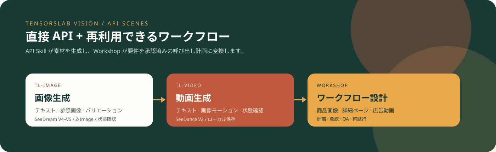
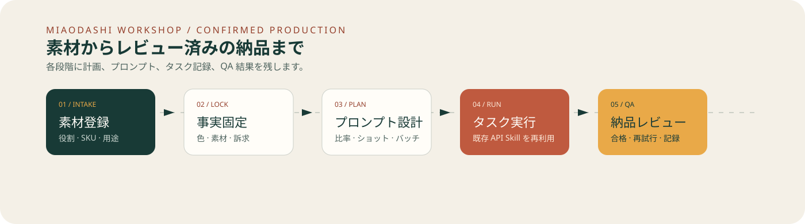
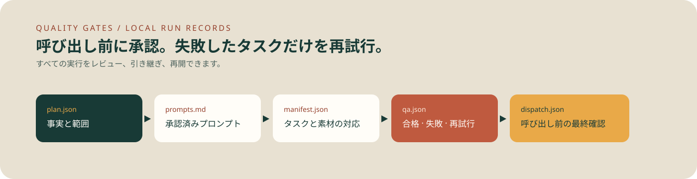

# TensorsLab Vision Skills

<p align="center">
  <a href="README.md">English</a> ·
  <a href="README.zh-CN.md">简体中文</a> ·
  <a href="README.ja.md">日本語</a> ·
  <a href="README.ko.md">한국어</a>
</p>

<p align="center">
  
</p>

このリポジトリには、ソースを確認してインストールできる 3 つの Skill があります。

- `tl-image`: テキストまたは画像から生成タスクを送信し、状態を確認して結果を保存します。
- `tl-video`: テキストまたは画像から動画タスクを送信し、状態を確認して結果を保存します。
- `miaodashi-workshop`: 計画、承認、実行コマンド、QA、再試行状態をローカルに記録します。生成には上記クライアントを再利用します。

[miaodashi.com](https://miaodashi.com) は任意のノーコード製品です。オープンソースの API Skill は単独で使用できます。

## 実装済みの範囲

| 機能 | 状態 | 境界 |
| --- | --- | --- |
| Text-to-Image / Image-to-Image | **実装済み** | SeeDream V4/V4.5 と Z-Image API を呼び出します。 |
| Text-to-Video / Image-to-Video | **実装済み** | 4 種類の SeeDance API を呼び出します。 |
| 状態確認とローカル保存 | **実装済み** | 非同期タスクをポーリングして結果を保存します。 |
| API を呼ばないプレビュー | **実装済み** | `--dry-run` は API Key もクレジットも使用しません。 |
| 計画 → 承認 → コマンド → QA | **ローカル実装済み** | JSON/Markdown と実行コマンドを生成します。 |
| 商品画像セット、複数比率、SKU 計画 | **ワークフロー実装済み** | タスク単位の実行。並列バッチ実行は未実装です。 |
| レタッチ、透かし・物体削除、顔置換 | **生成 AI のベストエフォート** | 汎用 Image-to-Image とプロンプトを使用。専用マスク API ではありません。 |
| 正確な部分置換 | **未実装** | マスク API または合成ツールが必要です。 |
| ブラウザ UI とチームレビュー | **本リポジトリ外** | 必要な場合は Miaodashi を利用してください。 |

公開 CI では秘密鍵とクレジットが必要な実生成を行いません。CLI とローカルワークフローはオフラインテストで検証します。

## インストール

```text
/plugin marketplace add miyakooy/TensorsLab-Vison
/plugin install tl-image@tensorslab-skills
/plugin install tl-video@tensorslab-skills
/plugin install miaodashi-workshop@tensorslab-skills
```

明示的な呼び出し例：

```text
/tl-image:tensorslab-image 陶器カップの 4:5 商品写真を生成してください。
/tl-video:tensorslab-video product.jpg を 5 秒の縦型商品動画にしてください。
/miaodashi-workshop:miaodashi-workshop 商品画像を 5 枚計画し、承認後に API コマンドを作成してください。
```

## CLI クイックスタート

```bash
git clone https://github.com/miyakooy/TensorsLab-Vison.git
cd TensorsLab-Vison
python -m pip install -r requirements.txt
export TENSORSLAB_API_KEY="your-api-key"
```

API を呼ばずに内容を確認：

```bash
python skills/tl-image/scripts/tensorslab_image.py \
  "白い陶器カップの商品写真、形状と色を保持" \
  --model seedreamv45 --resolution 4:5 --dry-run
```

実際に生成：

```bash
python skills/tl-image/scripts/tensorslab_image.py \
  "白い陶器カップの商品写真、形状と色を保持" \
  --model seedreamv45 --resolution 4:5
```

動画：

```bash
python skills/tl-video/scripts/tensorslab_video.py \
  "商品をゆっくり周回し、形状とラベルを保持" \
  --source ./product.jpg --model seedancev2 --ratio 9:16 --duration 5
```

API Key は [TensorsLab Console](https://tensorai.tensorslab.com/) で取得できます。`--api-key` より環境変数を推奨します。

## ワークショップとテスト

<p align="center">
  
</p>

完全な手順は [`miaodashi-workshop/SKILL.md`](skills/miaodashi-workshop/SKILL.md) を参照してください。

<p align="center">
  
</p>

## コミュニティ作品とユースケース

[作品ギャラリーと再現可能なユースケース候補](examples/README.ja.md)では、EC 商品動画、商品比較、詳細ページ素材、エンターテインメント向け人物エフェクトを紹介しています。公開済みの参考作品と、このリポジトリだけで実行できるワークフローを明確に区別しています。

### Face swap / faceswap に対応していますか？

汎用の image-to-image API で顔の置換を試すことはできますが、専用の `faceswap`、`face-swap`、マスク、本人同一性保証、Deepfake パイプラインはありません。結果はベストエフォートとして全件確認し、使用権と本人同意がある素材だけを使用してください。

```bash
python -m unittest discover -s tests -v
```

- [画像 Skill](skills/tl-image/SKILL.md)
- [動画 Skill](skills/tl-video/SKILL.md)
- [コミュニティ作品](examples/README.ja.md) · [コントリビューションガイド](CONTRIBUTING.md)
- [GEO / 検索ディスカバリー](docs/discoverability.md)
- [GitHub Pages（日本語）](https://miyakooy.github.io/TensorsLab-Vison/ja/)
