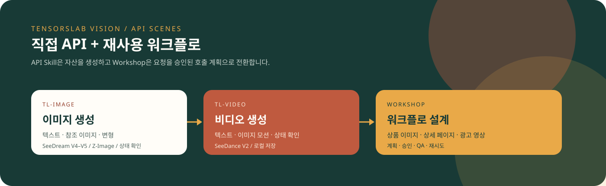
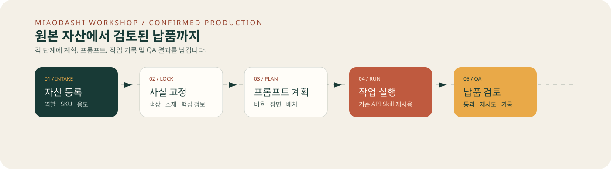
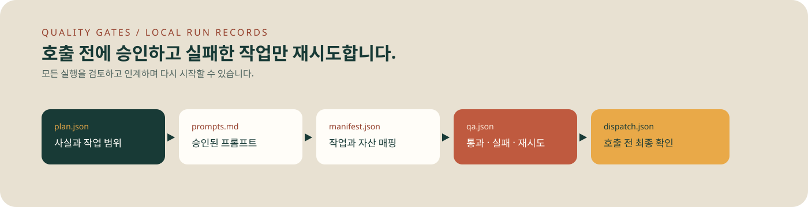

# TensorsLab Vision Skills

<p align="center">
  <a href="README.md">English</a> ·
  <a href="README.zh-CN.md">简体中文</a> ·
  <a href="README.ja.md">日本語</a> ·
  <a href="README.ko.md">한국어</a>
</p>

<p align="center">
  
</p>

이 저장소에는 소스를 확인하고 설치할 수 있는 세 가지 Skill이 있습니다.

- `tl-image`: 텍스트-이미지 및 이미지-이미지 작업을 제출하고 상태를 확인한 뒤 결과를 저장합니다.
- `tl-video`: 텍스트-비디오 및 이미지-비디오 작업을 제출하고 상태를 확인한 뒤 결과를 저장합니다.
- `miaodashi-workshop`: 계획, 승인, 실행 명령, QA 및 재시도 상태를 로컬에 기록합니다. 생성에는 위 API 클라이언트를 재사용합니다.

[miaodashi.com](https://miaodashi.com)은 선택 가능한 노코드 제품입니다. 오픈소스 API Skill은 독립적으로 사용할 수 있습니다.

## 실제 구현 범위

| 기능 | 상태 | 경계 |
| --- | --- | --- |
| 텍스트-이미지 / 이미지-이미지 | **구현됨** | SeeDream V4/V4.5 및 Z-Image API를 호출합니다. |
| 텍스트-비디오 / 이미지-비디오 | **구현됨** | 네 가지 SeeDance API를 호출합니다. |
| 상태 폴링 및 로컬 다운로드 | **구현됨** | 비동기 작업을 확인하고 반환 파일을 저장합니다. |
| API 호출 없는 미리보기 | **구현됨** | `--dry-run`은 API Key나 크레딧을 사용하지 않습니다. |
| 계획 → 승인 → 명령 → QA | **로컬 구현됨** | JSON/Markdown 기록과 정확한 명령을 생성합니다. |
| 상품 이미지 세트, 여러 비율, SKU 계획 | **워크플로 구현됨** | 작업별 실행은 가능하지만 병렬 배치 실행기는 없습니다. |
| 리터치, 워터마크·객체 제거, 얼굴 교체 | **생성형 최선 노력** | 일반 이미지-이미지와 프롬프트를 사용하며 전용 마스크 API가 아닙니다. |
| 정확한 부분 교체 | **미구현** | 마스크 API 또는 합성 도구가 필요합니다. |
| 브라우저 UI와 팀 검토 | **저장소 외부** | 필요한 경우 Miaodashi를 사용하세요. |

공개 CI에서는 비밀 API Key와 크레딧이 필요한 실제 생성을 실행하지 않습니다. CLI와 로컬 워크플로는 오프라인 테스트로 검증합니다.

## 설치

```text
/plugin marketplace add miyakooy/TensorsLab-Vison
/plugin install tl-image@tensorslab-skills
/plugin install tl-video@tensorslab-skills
/plugin install miaodashi-workshop@tensorslab-skills
```

명시적으로 호출하는 예:

```text
/tl-image:tensorslab-image 도자기 컵의 4:5 상품 이미지를 생성해 주세요.
/tl-video:tensorslab-video product.jpg를 5초 세로형 상품 영상으로 만들어 주세요.
/miaodashi-workshop:miaodashi-workshop 상품 이미지 5장을 계획하고 승인 후 API 명령을 준비해 주세요.
```

## CLI 빠른 시작

```bash
git clone https://github.com/miyakooy/TensorsLab-Vison.git
cd TensorsLab-Vison
python -m pip install -r requirements.txt
export TENSORSLAB_API_KEY="your-api-key"
```

API를 호출하지 않고 요청 확인:

```bash
python skills/tl-image/scripts/tensorslab_image.py \
  "흰색 도자기 컵 상품 사진, 모양과 색상을 유지" \
  --model seedreamv45 --resolution 4:5 --dry-run
```

실제 이미지 생성:

```bash
python skills/tl-image/scripts/tensorslab_image.py \
  "흰색 도자기 컵 상품 사진, 모양과 색상을 유지" \
  --model seedreamv45 --resolution 4:5
```

비디오 생성:

```bash
python skills/tl-video/scripts/tensorslab_video.py \
  "제품 주위를 천천히 회전하며 모양과 라벨 유지" \
  --source ./product.jpg --model seedancev2 --ratio 9:16 --duration 5
```

API Key는 [TensorsLab Console](https://tensorai.tensorslab.com/)에서 받을 수 있습니다. `--api-key`보다 환경 변수를 권장합니다.

## 워크숍과 테스트

<p align="center">
  
</p>

전체 과정은 [`miaodashi-workshop/SKILL.md`](skills/miaodashi-workshop/SKILL.md)를 참고하세요.

<p align="center">
  
</p>

```bash
python -m unittest discover -s tests -v
```

- [이미지 Skill](skills/tl-image/SKILL.md)
- [비디오 Skill](skills/tl-video/SKILL.md)
- [GEO / 검색 노출 가이드](docs/discoverability.md)
- [GitHub Pages](https://miyakooy.github.io/TensorsLab-Vison/)
