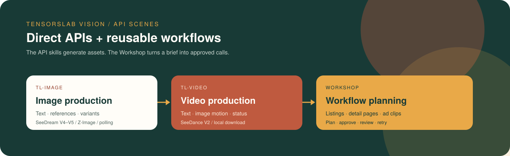
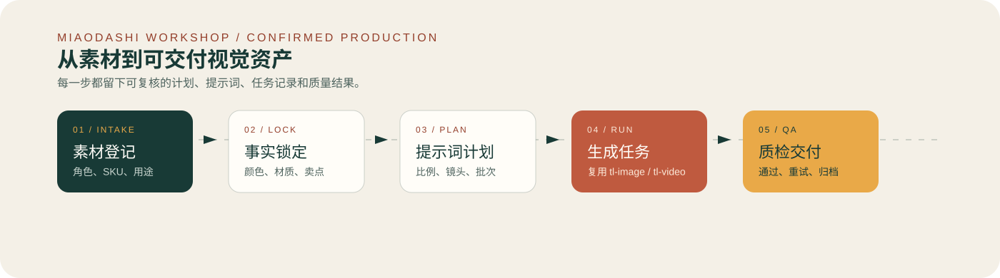
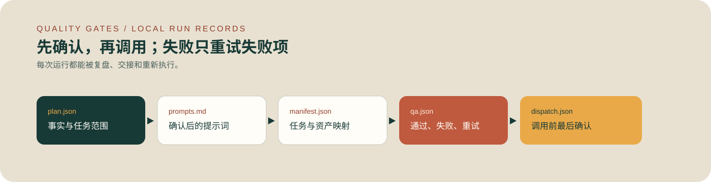

# TensorsLab Vision Skills

<p align="center">
  <strong>Executable image and video API skills, plus a review-first production planner.</strong>
</p>

<p align="center">
  <a href="README.md">English</a> ·
  <a href="README.zh-CN.md">简体中文</a> ·
  <a href="README.ja.md">日本語</a> ·
  <a href="README.ko.md">한국어</a>
</p>

<p align="center">
  
</p>

This repository contains three installable skills:

- `tl-image`: submits text-to-image or image-to-image tasks, polls their status, and downloads results.
- `tl-video`: submits text-to-video or image-to-video tasks, polls their status, and downloads results.
- `miaodashi-workshop`: creates local plans, approval records, dispatch commands, QA records, and selective retry state. It reuses the two API clients above and does **not** contain a second generation API.

The no-code product at [miaodashi.com](https://miaodashi.com) is optional. The open-source API skills work independently.

## What is actually implemented?

| Capability | Status | Evidence / boundary |
| --- | --- | --- |
| Text-to-image and image-to-image | **Implemented** | `tensorslab_image.py` calls the documented SeeDream V4/V4.5 and Z-Image endpoints. |
| Text-to-video and image-to-video | **Implemented** | `tensorslab_video.py` calls four documented SeeDance endpoints. |
| Task polling and local download | **Implemented** | Both clients poll task status and save returned URLs locally. |
| Credential-free request preview | **Implemented** | Both clients support `--dry-run`; no API key or paid request is used. |
| Plan → approval → dispatch → QA record | **Implemented locally** | Four workshop scripts create JSON/Markdown records and exact client commands. |
| Listing kits, creative batches, multi-ratio plans, SKU plans | **Workflow implemented** | Planning and per-task dispatch exist; there is no parallel batch executor yet. |
| Retouch, watermark removal, object removal, face replacement | **Generative best effort** | These use the general image-to-image endpoint plus prompts. There is no dedicated mask or deterministic editing API in this repository. |
| Exact masked/local replacement | **Not implemented** | The workflow stops at `approved_pending_capability`. A mask API or compositor is required. |
| Deterministic typography and legal copy layout | **Not implemented** | Add approved copy in a design/post-production tool. |
| Browser UI, team review, managed batch delivery | **Not in this repository** | Use [Miaodashi](https://miaodashi.com) if that product workflow is required. |

> Verification level: the repository has offline smoke tests for CLI validation and the complete local workshop lifecycle. Live generation is not run in public CI because it needs a private API key and consumes credits.

## Install

### Claude Code marketplace

```text
/plugin marketplace add miyakooy/TensorsLab-Vison
/plugin install tl-image@tensorslab-skills
/plugin install tl-video@tensorslab-skills
/plugin install miaodashi-workshop@tensorslab-skills
```

After installation, describe the task naturally or invoke the installed skill explicitly, for example:

```text
/tl-image:tensorslab-image Generate a 4:5 studio product image of a ceramic cup.
/tl-video:tensorslab-video Animate product.jpg into a 5-second 9:16 turntable shot.
/miaodashi-workshop:miaodashi-workshop Plan five listing images, ask me to approve them, then prepare the API commands.
```

### Clone and use the Python clients directly

```bash
git clone https://github.com/miyakooy/TensorsLab-Vison.git
cd TensorsLab-Vison
python -m pip install -r requirements.txt
export TENSORSLAB_API_KEY="your-api-key"
```

Get an API key from the [TensorsLab Console](https://tensorai.tensorslab.com/). Prefer the environment variable over `--api-key` so the secret is not saved in shell history.

## Quick start

Preview a request without an API key or API call:

```bash
python skills/tl-image/scripts/tensorslab_image.py \
  "studio product photo of a ceramic cup" \
  --model seedreamv45 --resolution 4:5 --batch-size 3 --dry-run
```

Generate an image:

```bash
python skills/tl-image/scripts/tensorslab_image.py \
  "studio product photo of a ceramic cup" \
  --model seedreamv45 --resolution 4:5
```

Animate a local image:

```bash
python skills/tl-video/scripts/tensorslab_video.py \
  "slow camera orbit; preserve the product shape and label" \
  --source ./product.jpg --model seedancev2 \
  --ratio 9:16 --duration 5 --resolution 1080p
```

Outputs are downloaded to `./tensorslab_output/` unless `--output-dir` is supplied.

## Review-first ecommerce workflow

<p align="center">
  
</p>

Create a local plan. This command does not call the API:

```bash
python skills/miaodashi-workshop/scripts/create_run.py \
  --project cup-launch \
  --scenario listing-kit \
  --platform amazon \
  --source ./product-front.jpg \
  --source ./product-side.jpg
```

Then:

1. Fill `constraints` and every task prompt in `.miaodashi_output/cup-launch/plan.json`.
2. Review `prompts.md` and obtain explicit user approval.
3. Record approval with `approve_run.py`.
4. Build exact, review-only client commands with `prepare_dispatch.py`.
5. Run approved commands one task at a time and record outputs with `record_result.py`.

<p align="center">
  
</p>

See [`skills/miaodashi-workshop/SKILL.md`](skills/miaodashi-workshop/SKILL.md) for the full commands and supported scenarios.

## Test

```bash
python -m unittest discover -s tests -v
```

The tests make no paid API calls. To verify live generation, run one low-cost request with your own key after checking `--dry-run` output.

## Documentation and discovery

- [Image skill](skills/tl-image/SKILL.md) · [Image API reference](skills/tl-image/references/api_reference.md)
- [Video skill](skills/tl-video/SKILL.md) · [Video API reference](skills/tl-video/references/api_reference.md)
- [Workshop skill](skills/miaodashi-workshop/SKILL.md) · [Quality gates](skills/miaodashi-workshop/references/quality-gates.md)
- [GEO / search discoverability notes](docs/discoverability.md)
- [GitHub Pages site](https://miyakooy.github.io/TensorsLab-Vison/)

GitHub Pages must first be enabled under **Settings → Pages → Source: GitHub Actions**. The workflow cannot create that repository setting by itself.
