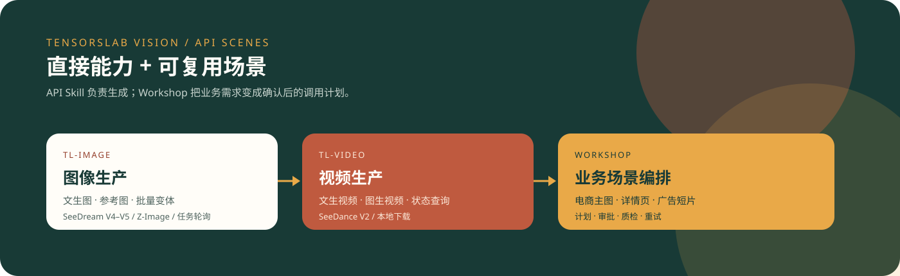
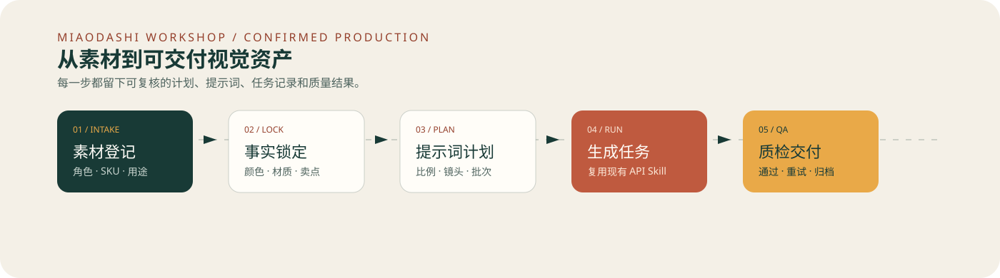
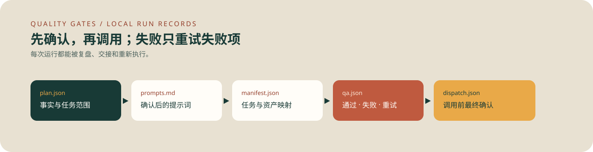

# TensorsLab Vision Skills

<p align="center">
  <a href="README.md">English</a> ·
  <a href="README.zh-CN.md">简体中文</a> ·
  <a href="README.ja.md">日本語</a> ·
  <a href="README.ko.md">한국어</a>
</p>

<p align="center">
  
</p>

这个仓库不是 Miaodashi 产品功能的宣传页，而是三个可以安装和检查源码的 Skill：

- `tl-image`：提交文生图或图生图任务，轮询状态并下载结果。
- `tl-video`：提交文生视频或图生视频任务，轮询状态并下载结果。
- `miaodashi-workshop`：在本地创建计划、审批记录、调用命令、质检记录和失败重试状态；生成阶段复用前两个客户端。

[miaodashi.com](https://miaodashi.com) 是可选的无代码产品。本仓库的 API Skill 可以独立使用。

## 真实能力清单

| 能力 | 状态 | 实现边界 |
| --- | --- | --- |
| 文生图、图生图 | **已实现** | Python 客户端调用 SeeDream V4/V4.5 与 Z-Image 接口。 |
| 文生视频、图生视频 | **已实现** | Python 客户端调用四个 SeeDance 接口。 |
| 任务轮询和本地下载 | **已实现** | 查询异步任务状态并保存返回文件。 |
| 不消耗积分的请求预览 | **已实现** | 两个客户端都支持 `--dry-run`，不需要 API Key。 |
| 计划、审批、派发、质检记录 | **本地已实现** | 四个脚本输出 JSON/Markdown，并生成准确的客户端命令。 |
| 主图组、创意批次、多比例、SKU 批量计划 | **编排已实现** | 可以逐任务派发；尚无并行批量执行器。 |
| 精修、去水印、物体擦除、换脸 | **生成式尽力而为** | 使用通用图生图加提示词，不是专用遮罩或确定性编辑接口。 |
| 精确局部替换 | **未实现** | 流程会停在 `approved_pending_capability`，需要遮罩 API 或后期合成。 |
| 确定性文字排版、法务文案上图 | **未实现** | 应交给设计或后期工具处理。 |
| 浏览器 UI、团队审核、托管交付 | **不在本仓库** | 需要这类产品能力时再使用 Miaodashi。 |

> 验证说明：仓库包含 CLI 参数和完整本地工作流的离线测试。公开 CI 不执行真实生成，因为它需要私有 API Key 并会消耗积分。

## 安装

### Claude Code

```text
/plugin marketplace add miyakooy/TensorsLab-Vison
/plugin install tl-image@tensorslab-skills
/plugin install tl-video@tensorslab-skills
/plugin install miaodashi-workshop@tensorslab-skills
```

安装后可以直接描述任务，或显式调用：

```text
/tl-image:tensorslab-image 生成一张 4:5 的陶瓷杯棚拍商品图。
/tl-video:tensorslab-video 将 product.jpg 做成 5 秒 9:16 商品环绕镜头。
/miaodashi-workshop:miaodashi-workshop 先规划 5 张商品详情图，等我批准后再准备 API 命令。
```

### 直接使用 Python 客户端

```bash
git clone https://github.com/miyakooy/TensorsLab-Vison.git
cd TensorsLab-Vison
python -m pip install -r requirements.txt
export TENSORSLAB_API_KEY="your-api-key"
```

API Key 可在 [TensorsLab Console](https://tensorai.tensorslab.com/) 获取。推荐使用环境变量，不要把密钥写入命令历史、计划或日志。

## 最快使用方式

先预览请求，不调用 API：

```bash
python skills/tl-image/scripts/tensorslab_image.py \
  "白色陶瓷杯，暖色棚拍光线，保持杯身结构准确" \
  --model seedreamv45 --resolution 4:5 --batch-size 3 --dry-run
```

确认后生成图片：

```bash
python skills/tl-image/scripts/tensorslab_image.py \
  "白色陶瓷杯，暖色棚拍光线，保持杯身结构准确" \
  --model seedreamv45 --resolution 4:5
```

让本地图片生成视频：

```bash
python skills/tl-video/scripts/tensorslab_video.py \
  "镜头缓慢环绕商品，保持外形、标签和颜色不变" \
  --source ./product.jpg --model seedancev2 \
  --ratio 9:16 --duration 5 --resolution 1080p
```

默认输出到 `./tensorslab_output/`。

## 电商审核工作流

<p align="center">
  
</p>

先创建不调用 API 的本地计划：

```bash
python skills/miaodashi-workshop/scripts/create_run.py \
  --project cup-launch \
  --scenario listing-kit \
  --platform amazon \
  --source ./product-front.jpg \
  --source ./product-side.jpg
```

之后依次补全 `plan.json`、确认 `prompts.md`、执行 `approve_run.py`、生成 `dispatch.json`，最后逐项执行并用 `record_result.py` 登记结果。完整命令见 [`miaodashi-workshop/SKILL.md`](skills/miaodashi-workshop/SKILL.md)。

<p align="center">
  
</p>

## 社区作品与场景

查看[作品展示与可复现用例队列](examples/README.md)，其中包括电商商品短视频、商品对比、详情页视觉组和泛娱乐人物特效。页面会明确区分“已经可以由本仓库执行的工作流”和“仍在征集完整配方的视觉参考”。

### 支持 Face Swap / faceswap 吗？

当前只能通过通用图生图接口尝试**人脸替换**，属于生成式尽力而为。本仓库没有专用 `faceswap`、`face-swap`、遮罩、身份一致性或 Deepfake 流程。必须逐张审核，并且只能使用拥有使用权且已经获得相关人物同意的素材。

## 测试

```bash
python -m unittest discover -s tests -v
```

测试不会调用付费 API。真实生成建议先检查 `--dry-run`，再使用自己的 Key 运行一个低成本任务。

## 文档

- [图像 Skill](skills/tl-image/SKILL.md) · [图像 API](skills/tl-image/references/api_reference.md)
- [视频 Skill](skills/tl-video/SKILL.md) · [视频 API](skills/tl-video/references/api_reference.md)
- [工作坊 Skill](skills/miaodashi-workshop/SKILL.md) · [质量门禁](skills/miaodashi-workshop/references/quality-gates.md)
- [社区作品展示](examples/README.md) · [贡献指南](CONTRIBUTING.md)
- [GEO 与搜索收录说明](docs/discoverability.md)
- [GitHub Pages 展示页](https://miyakooy.github.io/TensorsLab-Vison/)
